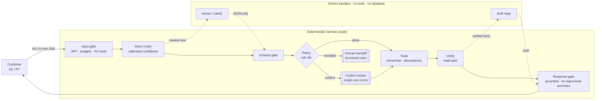

# AIDO · AI-first banking customer service

Team **AIDO** · [Factored AI & Data Hackathon 2026](https://www.factored.ai/careers/ai-data-hackathon)

A customer-service system for a LATAM bank that answers account and transaction questions and takes dispute claims in **Spanish and Portuguese**. It resolves what it safely can, asks when a request is ambiguous, refuses what is out of scope, and hands off to a human with a structured case file.

> **Principle:** the model understands and writes; deterministic code decides and acts.

**Status:** design complete, implementation in progress (see [Roadmap](#roadmap)). No results are reported yet: every number below comes from the data audit, not from the system.

---

## The problem, from the data

We audited the organizer dataset (synthetic LATAM Bank: about 19M rows, 13 tables, Mexico, Colombia, Argentina) before choosing a workflow. Full audit: [`docs/data_findings.md`](docs/data_findings.md).

| Contact reason | Share of 686,296 contacts | Resolved on first contact | Avg. duration |
|---|---|---|---|
| Transactional | **35.0%** | 91.5% | 221 s |
| Product | 22.0% | 89.6% | 266 s |
| Complaint | 17.1% | **43.6%** | 435 s |
| Technical | 15.0% | 69.9% | 360 s |

In complaints (67,095), *unrecognized charge* and *incorrect fee* are the two largest categories at about 36% combined. Roughly 1 in 5 breaches its SLA, and the average resolution takes 15.5 days.

**Chosen workflow:** account and transaction inquiries, with dispute intake for unrecognized or incorrect charges. Inquiries are the highest-volume, most automatable contacts. Disputes are the most common complaint and the slowest to resolve.

**What the audit also showed:**
- Call transcripts are templated: 42 distinct customer texts.
- Transcript topic labels are unrelated to the text (label purity 0.349, the same as chance).
- There is no Portuguese text at all.
- `is_fraud` is a deterministic function of `fraud_score`.

So the intent model is trained on clearly labeled, team-generated data, and fraud handling is a rule, not a model. Both choices are reported as limitations.

## How it works



- **One focused workflow, built deep.** The intents are `check_balance`, `list_transactions`, `explain_charge`, `dispute_charge`, `request_human` and `out_of_scope`.
- **Policy lives in code, not in prompts.** Automatic dispute intake requires all of the following:
  - the charge is approved and belongs to the customer;
  - it is at most 90 days old and at most USD 250;
  - its `fraud_score` is below 30;
  - it has not been disputed before.

  Everything else escalates with the triggering rule id. These thresholds are a synthetic team policy, labeled as such.
- **Provenance-typed values.** Customer identity comes only from the session token. The records the system acts on come only from the database. A value extracted by the model can never select whose data is read or which charge is disputed (rule `PROV_001`).
- **Out-of-band confirmation.** A dispute is created only after the customer presses a button that carries a single-use nonce issued by the server. A typed "sí" can never confirm an action.
- **Grounded answers.** Every amount and id in a reply must exist in the verified facts. Commitments ("review takes up to N days") come only from policy templates. The response gate also checks for a canary token, PII leakage and the wrong language.
- **No money moves.** No tool exists to refund, reverse, block or approve anything.

Diagrams of the data flow, conversation graph, GCP deployment, LangGraph runtime and guardrail harness are in [`docs/architecture.html`](docs/architecture.html) (download and open it locally).

## Evaluation plan

The baseline and the proposed system replay the same frozen held-out workload: about 200 multi-turn scenarios, half Spanish and half Portuguese. The workload covers normal, ambiguous, out-of-scope and must-escalate cases, plus attacks and injected tool failures. The only architectural difference between the two is the policy gate.

- **Pass/fail is deterministic:** outcome class, rule ids in the trace, whether the dispute exists in the database, and a cross-customer data leak scan. An LLM judge scores only response quality, and is validated against human labels (Cohen's κ ≥ 0.6).
- **Red teaming uses [promptfoo](https://www.promptfoo.dev/):** OWASP LLM and Agentic plugins in ES/PT, multi-turn strategies (Crescendo, GOAT, Hydra), and indirect injection through data fields.
- **Reported metrics:**
  - safe automated resolution rate;
  - containment (reported separately, not as success);
  - missed and unnecessary escalations;
  - unsafe outcomes with counts and denominators;
  - attack success rate per class;
  - false refusals;
  - p50/p95 latency and cost per case;
  - all of the above by language, with small-sample caveats.

## Stack

| Layer | Choice |
|---|---|
| Runtime / API | [Bun](https://bun.sh) + [Elysia](https://elysiajs.com), TypeScript end to end |
| Orchestration | [LangGraph JS](https://langchain-ai.github.io/langgraphjs/) with custom nodes, interrupts and a SQLite checkpointer |
| Models | Gemini Flash (extraction and replies), intent router: Jev vs. own embeddings + logistic regression vs. baselines |
| Agent ↔ UI | [AG-UI](https://docs.ag-ui.com) protocol over SSE |
| Frontend | React + Vite + TanStack Router |
| Data | DuckDB pipeline with data contracts → `serving.sqlite` |
| Observability | OpenTelemetry GenAI conventions → Langfuse; hash-chained audit log |
| Deploy | Google Cloud Run (single container) |

## Repository layout

```
pipeline/   data contracts, incremental staging, curation, quality report (Bun + DuckDB)
server/     auth, tools, policy engine, gates, LangGraph graph, API (in progress)
tests/      unit and end-to-end tests (bun test)
reports/    generated data-quality, demand and evaluation reports
docs/
  data_findings.md          dataset audit
  architecture.html         system diagrams
  research/                 guardrails, AG-UI and CopilotKit research with sources
  superpowers/specs/        system design spec
  superpowers/plans/        implementation plans
```

## Setup

Requires Bun 1.3+.

```bash
bun install
cp .env.example .env   # organizer S3 credentials: never commit .env
bun run download       # mirror the dataset into data/raw (idempotent)
bun run pipeline       # contracts → staging → serving.sqlite, marts, reports
bun test
```

The dataset and the derived `serving.sqlite` are distributed to participants only. They are never committed to this public repository.

### Run the assistant API

```bash
export JWT_SECRET=$(openssl rand -hex 32)   # required, ≥ 32 chars
export GEMINI_API_KEY=...                    # optional; without it the assistant uses templates and escalates
bun run dev                                  # http://localhost:8080
bun run smoke                                # scripted ES/PT turns over data/serving.sqlite
```

| Route | Purpose |
|---|---|
| `GET /api/health` | Liveness check |
| `GET /api/demo-users` | Demo personas available to log in as |
| `POST /api/auth/login` | Demo login `{persona, pin, language}` → JWT (15 min) |
| `POST /api/auth/logout` | Ends the caller's own session; its token stops verifying immediately |
| `POST /api/agui/run` | AG-UI `RunAgentInput` → SSE events; `threadId` must be the session id |
| `GET /api/chat/messages` | Agent replies for a handed-off customer |
| `POST /api/auth/agent` | Agent login |
| `GET /api/agent/queue`, `POST /api/agent/sessions/:id/{take,reply,resume}` | Agent console |
| `GET /api/agent/sessions/:id/messages` | Full message history for a session (agent only) |
| `GET /api/trace/:session` | Spans for the trace view (agent, or the session itself) |

Optional env: `GEMINI_MODEL` (default `gemini-3.8-flash`), `MODEL_TIMEOUT_MS`, `SAFE_MODE=1`, `PORT`, `DEMO_PIN`, `AGENT_PIN`, `SERVING_PATH`, `OPS_PATH`.

**Limits:** the per-session lock and the provider circuit breaker (`server/graph/turn.ts`, `server/gates/budget.ts`) are in-process state — run a single instance (e.g. Cloud Run `--max-instances=1`); that state (and the SQLite-backed sessions, checkpoints and queue) is lost on restart. The production path is Postgres/Redis for this state (see [Known limitations](#known-limitations)). `DEMO_PIN` and `AGENT_PIN` default to `2468`/`1357` for the demo only and must be overridden in any shared deployment.

Pipeline outputs:
- `data/serving.sqlite`: customer subset and demo personas used by the app (not committed).
- `data/marts/*.parquet`: demand evidence.
- `reports/quality.md`, `reports/demand.md`: data quality and demand reports (committed).
- `data/runs/<run_id>/manifest.json`: lineage (input fingerprints, per-stage counts, output hash).

`serving.sqlite` contract (read by the server): tables `customers`, `products` (`product_number_masked`), `transactions` (ISO `transaction_date`, `amount_usd` derived for USD rows and null for ~2% of ARS/COP rows, no `is_fraud`), `complaints` (`is_repeat_complainer` 0/1), `demo_users`, `meta` (`clock`, `window_days`, `built_at`).

## Roadmap

| Plan | Scope | Status |
|---|---|---|
| 1 | Foundation and data pipeline | in progress |
| 2a | Core domain: auth, tools, policy, gates | planned |
| 2b | Conversation graph, Gemini, AG-UI API, agent console, traces | planned |
| 3 | Intent router: dataset, four-way comparison, calibration | planned |
| 4 | Web UI: chat, agent console, trace viewer | planned |
| 5 | Evaluation harness and red teaming | planned |
| 6 | Deployment and operations on GCP | planned |

## Known limitations

- The data is synthetic. Text fields are templated, so supervised NLP on the provided transcripts is not meaningful.
- There is no Portuguese source data. Portuguese coverage comes from team-generated, labeled examples.
- Evaluation samples are small. Zero observed failures does not mean zero risk.
- Writable state lives in container-local SQLite, so the service runs as a single Cloud Run instance. The production path is Postgres / Cloud SQL.

## Documentation

- Design spec: [`docs/superpowers/specs/2026-10-02-banking-cs-system-design.md`](docs/superpowers/specs/2026-10-02-banking-cs-system-design.md)
- Dataset audit: [`docs/data_findings.md`](docs/data_findings.md)
- Guardrails, AG-UI and CopilotKit research: [`docs/research/2026-10-02-harness-guardrails-and-agui.md`](docs/research/2026-10-02-harness-guardrails-and-agui.md)
