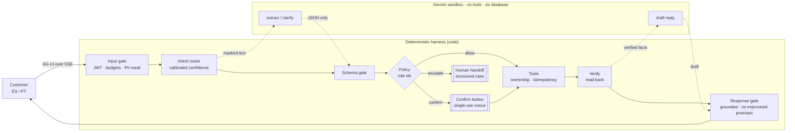

# AIDO · AI-first banking customer service

Team **AIDO** · [Factored AI & Data Hackathon 2026](https://www.factored.ai/careers/ai-data-hackathon)

A customer-service system for a LATAM bank that answers account and transaction questions and takes dispute claims in **Spanish and Portuguese**. It resolves what it safely can, asks when a request is ambiguous, refuses what is out of scope, and hands off to a human with a structured case file.

> **Principle:** the model understands and writes; deterministic code decides and acts.

**Status:** core service implemented on Postgres/Supabase; UI, router comparison and evaluation in progress (see [Roadmap](#roadmap)). No results are reported yet: every number below comes from the data audit, not from the system.

---

## The problem, from the data

We audited the organizer dataset (synthetic LATAM Bank: about 19M rows, 13 tables, Mexico, Colombia, Argentina) before choosing a workflow. Full audit: [`docs/data_findings.md`](docs/data_findings.md).

| Contact reason | Share of 686,296 contacts | Resolved on first contact | Avg. duration |
|---|---|---|---|
| Transactional | **35.0%** | 91.5% | 221 s |
| Product | 22.0% | 89.6% | 266 s |
| Complaint | 17.1% | **43.6%** | 435 s |
| Technical | 15.0% | 69.9% | 360 s |

In complaints (67,095), *unrecognized charge* and *incorrect fee* are the two largest categories at about 36% combined. Roughly 1 in 5 breaches its SLA, and the average resolution takes 15.5 days.

**Chosen workflow:** account and transaction inquiries, with dispute intake for unrecognized or incorrect charges. Inquiries are the highest-volume, most automatable contacts. Disputes are the most common complaint and the slowest to resolve.

**What the audit also showed:**
- Call transcripts are templated: 42 distinct customer texts.
- Transcript topic labels are unrelated to the text (label purity 0.349, the same as chance).
- There is no Portuguese text at all.
- `is_fraud` is a deterministic function of `fraud_score`.

So the intent model is trained on clearly labeled, team-generated data, and fraud handling is a rule, not a model. Both choices are reported as limitations.

## How it works



- **One focused workflow, built deep.** The intents are `check_balance`, `list_transactions`, `explain_charge`, `dispute_charge`, `request_human` and `out_of_scope`.
- **Policy lives in code, not in prompts.** Automatic dispute intake requires all of the following:
  - the charge is approved and belongs to the customer;
  - it is at most 90 days old and at most USD 250;
  - its `fraud_score` is below 30;
  - it has not been disputed before.

  Everything else escalates with the triggering rule id. These thresholds are a synthetic team policy, labeled as such.
- **Provenance-typed values.** Customer identity comes only from the session token. The records the system acts on come only from the database. A value extracted by the model can never select whose data is read or which charge is disputed (rule `PROV_001`).
- **Out-of-band confirmation.** A dispute is created only after the customer presses a button that carries a single-use nonce issued by the server. A typed "sí" can never confirm an action.
- **Grounded answers.** Every amount and id in a reply must exist in the verified facts. Commitments ("review takes up to N days") come only from policy templates. The response gate also checks for a canary token, PII leakage and the wrong language.
- **No money moves.** No tool exists to refund, reverse, block or approve anything.

Diagrams of the data flow, conversation graph, GCP deployment, LangGraph runtime and guardrail harness are in [`docs/architecture.html`](docs/architecture.html) (download and open it locally).

## Evaluation

```bash
bun run eval --fake            # offline harness check with a scripted model (no key, no cost; not reportable)
bun run eval                   # dev subset (50 scenarios) × AIDO + naive baseline, real Gemini
bun run eval --subset=full     # all 124 scenarios; --run-limit=<usd> caps this run's spend
```

The baseline and AIDO replay the same frozen workload (`eval/data/scenarios.json`, sha256-checked): 124 multi-turn scenarios, half Spanish and half Portuguese, in 25 families — normal, ambiguous, out of scope, must escalate, adversarial (direct and indirect injection, cross-customer access, prompt extraction, typed confirmation), injected tool failures and null amounts, Portuñol and regionalisms. Every run gets its own PGlite clone of the demo data. The naive baseline is Gemini function calling over the same tools without the policy layer, out-of-band confirmation or gates. Results: [`reports/eval.md`](reports/eval.md); raw runs in `eval/runs/`.

- **Pass/fail is deterministic:** outcome class, rule ids in the trace, whether the dispute exists in the database, and a cross-customer data leak scan. An LLM judge scores only response quality, and is validated against human labels (Cohen's κ ≥ 0.6).
- **Red teaming uses [promptfoo](https://www.promptfoo.dev/):** OWASP LLM and Agentic plugins in ES/PT, multi-turn strategies (Crescendo, GOAT, Hydra), and indirect injection through data fields.
- **Reported metrics:**
  - safe automated resolution rate;
  - containment (reported separately, not as success);
  - missed and unnecessary escalations;
  - unsafe outcomes with counts and denominators;
  - attack success rate per class;
  - false refusals;
  - p50/p95 latency and cost per case;
  - all of the above by language, with small-sample caveats.

## Stack

| Layer | Choice |
|---|---|
| Runtime / API | [Bun](https://bun.sh) + [Elysia](https://elysiajs.com), TypeScript end to end |
| Orchestration | [LangGraph JS](https://langchain-ai.github.io/langgraphjs/) with custom nodes, interrupts and a Postgres checkpointer |
| Models | Gemini Flash (extraction and replies), intent router: Jev vs. own embeddings + logistic regression vs. baselines |
| Agent ↔ UI | [AG-UI](https://docs.ag-ui.com) protocol over SSE |
| Frontend | React + Vite + TanStack Router |
| Data | DuckDB pipeline with data contracts → `serving.sqlite` → Postgres `serving` schema |
| Database | [Supabase](https://supabase.com) Postgres (`serving` + `ops` schemas, RLS, not exposed via the Data API); [PGlite](https://pglite.dev) in tests and local dev |
| Observability | OpenTelemetry GenAI conventions → Langfuse; hash-chained audit log |
| Deploy | Google Cloud Run (single container) |

## Repository layout

```
pipeline/   data contracts, incremental staging, curation, quality report (Bun + DuckDB)
server/     auth, tools, policy engine, gates, LangGraph graph, API
web/        React + Vite UI: login, chat, agent console, trace viewer
supabase/   Postgres migrations (single source of the schema) and CLI config
tests/      unit and end-to-end tests (bun test)
reports/    generated data-quality, demand and evaluation reports
docs/
  data_findings.md          dataset audit
  architecture.html         system diagrams
  research/                 guardrails, AG-UI and CopilotKit research with sources
  superpowers/specs/        system design spec
  superpowers/plans/        implementation plans
```

## Setup

Requires Bun 1.3+.

```bash
bun install
cp .env.example .env   # never commit .env
bun test               # runs against in-process Postgres (PGlite); no services needed
```

**Data.** Pick one:

```bash
# A) Without the organizer dataset: synthetic demo data with the five demo personas
bun run seed:demo

# B) With the organizer S3 credentials in .env
bun run download       # mirror the dataset into data/raw (idempotent)
bun run pipeline       # contracts → staging → serving.sqlite, marts, reports
bun run publish        # serving.sqlite → Postgres serving schema
```

**Database.** With `DATABASE_URL` empty, the server and scripts use a local PGlite database in `data/pglite`. To use Supabase:

1. Create a project (CLI: `supabase projects create aido --region sa-east-1`), then `supabase link --project-ref <ref>`.
2. `bun run db:push` applies `supabase/migrations` (the server also applies them at startup; they are idempotent).
3. Set `DATABASE_URL` to the **session pooler** connection string (Project Settings → Database → Connection string). The transaction pooler (port 6543) also works.

Both schemas have row level security enabled with no policies and no grants for `anon`/`authenticated`: bank data is reachable only through the server's own Postgres role, never through the Supabase Data API.

The dataset and the derived `serving.sqlite` are distributed to participants only. They are never committed to this public repository.

### Run the assistant API

```bash
export JWT_SECRET=$(openssl rand -hex 32)   # required, ≥ 32 chars
export GEMINI_API_KEY=...                    # optional; without it the assistant uses templates and escalates
bun run dev                                  # http://localhost:8080
bun run smoke                                # scripted ES/PT turns over the configured database
```

### Web UI

```bash
bun run web:dev        # http://localhost:5173 (proxies /api to :8080; run `bun run dev` alongside)
bun run web:build      # web/dist, served by the API server at / (single container)
```

AIDO brand (emerald and gold, light and dark), desktop-first.

| Page | Who | Purpose |
|---|---|---|
| `/login` | customer | Pick a demo persona (each one demonstrates a policy path) and ES/PT |
| `/inicio` | customer | Accounts, 30-day spending by category, monthly trend, recent movements, quick actions |
| `/chat` | customer | Aida, the assistant: streaming AG-UI chat with rich cards (accounts, movements, confirmation, dispute, handoff); disputes are confirmed only with the nonce-bearing button; agent replies appear after a handoff |
| `/casos` | customer | The customer's disputes and handoffs with a status tracker |
| `/agent` | agent | Handoff queue triaged by rule priority, filters, new-case alerts, case card with plain-language rules, messenger-style replies |
| `/supervision` | agent | Live KPIs: automated resolution, latency p50/p95, AI cost, outcomes per turn, escalations by rule, intents, security signals, hourly volume |
| `/trace/:session` | agent / own session | Per-turn span timeline with rule ids, decisions, latency, tokens and cost |

| Route | Purpose |
|---|---|
| `GET /api/health` | Liveness check |
| `GET /api/demo-users` | Demo personas available to log in as |
| `POST /api/auth/login` | Demo login `{persona, pin, language}` → JWT (15 min) |
| `POST /api/auth/logout` | Ends the caller's own session; its token stops verifying immediately |
| `POST /api/agui/run` | AG-UI `RunAgentInput` → SSE events; `threadId` must be the session id |
| `GET /api/chat/messages` | Agent replies for a handed-off customer |
| `POST /api/auth/agent` | Agent login |
| `GET /api/agent/queue`, `POST /api/agent/sessions/:id/{take,reply,resume}` | Agent console |
| `GET /api/agent/sessions/:id/messages` | Full message history for a session (agent only) |
| `GET /api/trace/:session` | Spans for the trace view (agent, or the session itself) |
| `GET /api/me/overview`, `GET /api/me/cases` | Customer home and own cases (session customer only, projected fields) |
| `GET /api/ops/metrics?hours=` | Supervision aggregates (agent only; no message text) |

Optional env: `DATABASE_URL`, `PGLITE_DIR`, `ROUTER` (`auto` default, `keyword`, `embed-lr`), `GEMINI_MODEL` (default `gemini-3.8-flash`), `MODEL_TIMEOUT_MS`, `SAFE_MODE=1`, `PORT`, `DEMO_PIN`, `AGENT_PIN`, `SERVING_PATH` (for `publish`), `LLM_TOTAL_CAP_USD` (default `3`: hard cap on total project LLM spend; calls that could cross it are refused with `BUD_TOTAL` and the turn falls back to templates or a handoff).

**Limits:** sessions, checkpoints, disputes, the handoff queue, audit log and spans live in Postgres and survive restarts. Single-use nonces and the audit hash chain are safe across instances (atomic update, advisory lock). The per-session turn lock and the provider circuit breaker (`server/graph/turn.ts`, `server/gates/budget.ts`) are still in-process, so run a single instance or session-sticky routing until they move to Postgres advisory locks / Redis. `DEMO_PIN` and `AGENT_PIN` default to `2468`/`1357` for the demo only and must be overridden in any shared deployment.

### Train the intent router

Latest run (`reports/router.md`): keyword baseline macro-F1 0.631, embeddings + logistic regression 0.975 (selected; deployed threshold 0.60), Gemini zero-shot 1.000 (not deployable: it would add a fourth model call per turn). Both trained/zero-shot scores are near ceiling on a clean, hand-written test set written by the same author as the seeds (113 near-duplicate training rows were dropped); expect lower accuracy on real traffic, which plan 5 measures end to end. Total cost of data generation and training: about USD 0.19.

```bash
bun run ml:generate   # seeds + Gemini paraphrases → ml/data/router-train.jsonl (~$0.15)
bun run train         # keyword vs Gemini zero-shot vs embeddings + logistic regression → reports/router.md (~$0.15–0.45; zero-shot dominates; capped by ML_RUN_LIMIT_USD)
```

The test set (`ml/data/router-test.csv`, 237 hand-written ES/PT utterances) is frozen by hash before any model selection; training data is team-generated (hand-written seeds in `ml/data/router-seeds.csv` expanded by Gemini) and labeled as synthetic. `bun run train` writes `experiments/<run_id>.json`, `reports/router.md`, `ml/models/router-embed-lr.json` and `ml/models/router-selection.json`; the server's `ROUTER=auto` (default) follows that selection, `ROUTER=keyword|embed-lr` overrides it. Both scripts respect the project spend cap plus `ML_RUN_LIMIT_USD` (default `0.5`) per run; embeddings are cached in `data/ml-cache/`, and `ml:generate`'s paraphrases are cached there too, per seed family, so an interrupted or failed run resumes without re-paying for families already generated.

At runtime, the router's embedding calls are not chat calls: they bypass per-turn call counters and session/daily chat budgets, and are metered only by the project spend ledger (`LLM_TOTAL_CAP_USD`). Each router embedding costs about USD 0.000002.

Pipeline outputs:
- `data/serving.sqlite`: customer subset and demo personas, published to Postgres with `bun run publish` (not committed).
- `data/marts/*.parquet`: demand evidence.
- `reports/quality.md`, `reports/demand.md`: data quality and demand reports (committed).
- `data/runs/<run_id>/manifest.json`: lineage (input fingerprints, per-stage counts, output hash).

Serving contract (`serving.sqlite` and the Postgres `serving` schema read by the server): tables `customers`, `products` (`product_number_masked`), `transactions` (ISO `transaction_date`, `amount_usd` derived for USD rows and null for ~2% of ARS/COP rows, no `is_fraud`), `complaints` (`is_repeat_complainer` 0/1), `demo_users`, `meta` (`clock`, `window_days`, `built_at`).

## Roadmap

| Plan | Scope | Status |
|---|---|---|
| 1 | Foundation and data pipeline | done |
| 2a | Core domain: auth, tools, policy, gates | done |
| 2b | Conversation graph, Gemini, AG-UI API, agent console, traces | done |
| 2c | Postgres / Supabase for runtime state and serving data | done |
| 3 | Intent router: dataset, three-way comparison (keyword, Gemini zero-shot, embeddings + LR), calibration | done — embed-lr deployed: macro-F1 0.975 (95% CI 0.952–0.992) on the frozen 237-utterance test set; see [reports/router.md](reports/router.md) |
| 4 | Web UI: chat, agent console, trace viewer | done |
| 5 | Evaluation harness and baseline (promptfoo red teaming and LLM judge pending) | done |
| 6 | Deployment and operations on GCP | planned |

## Known limitations

- The data is synthetic. Text fields are templated, so supervised NLP on the provided transcripts is not meaningful.
- There is no Portuguese source data. Portuguese coverage comes from team-generated, labeled examples.
- Evaluation samples are small. Zero observed failures does not mean zero risk.
- Writable state is in Postgres (Supabase), but the per-session turn lock and the circuit breaker are in-process, so the service still runs as a single instance.

## Documentation

- Design spec: [`docs/superpowers/specs/2026-10-02-banking-cs-system-design.md`](docs/superpowers/specs/2026-10-02-banking-cs-system-design.md)
- Dataset audit: [`docs/data_findings.md`](docs/data_findings.md)
- Guardrails, AG-UI and CopilotKit research: [`docs/research/2026-10-02-harness-guardrails-and-agui.md`](docs/research/2026-10-02-harness-guardrails-and-agui.md)
