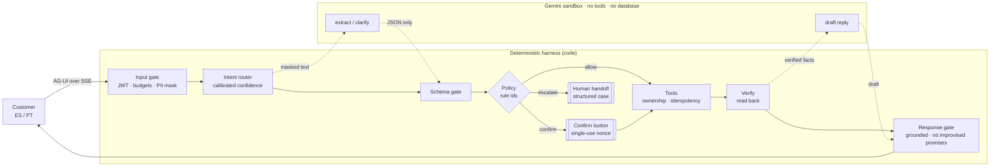
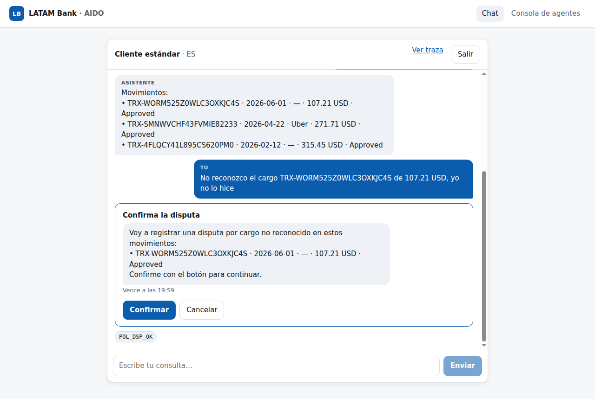
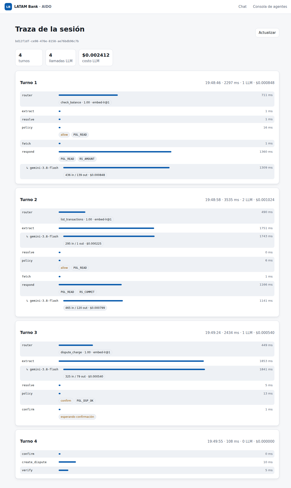
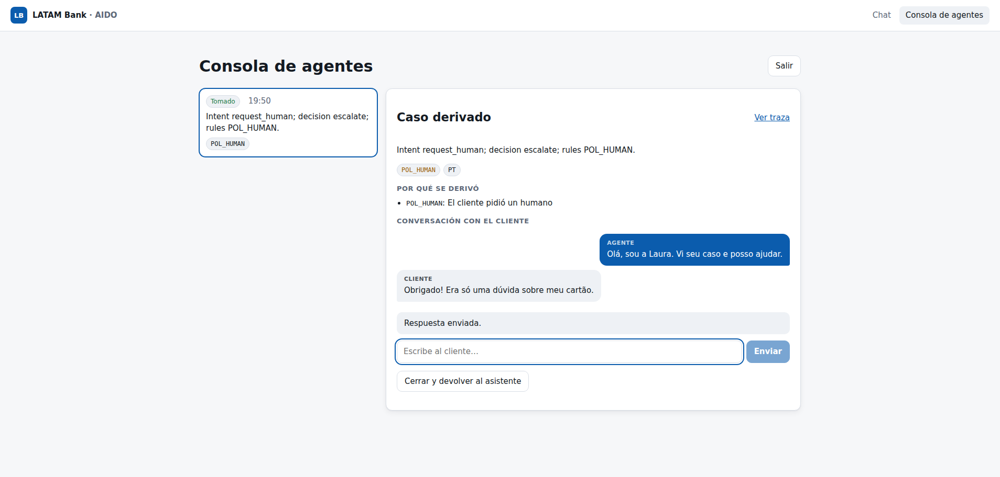

# AIDO · AI-first banking customer service

Team **AIDO** · [Factored AI & Data Hackathon 2026](https://www.factored.ai/careers/ai-data-hackathon)

A customer-service system for a LATAM bank that answers account and transaction questions and takes dispute claims in **Spanish and Portuguese**. It resolves what it safely can, asks when a request is ambiguous, refuses what is out of scope, and hands off to a human with a structured case file.

> **Principle:** the model understands and writes; deterministic code decides and acts.

**Status:** design complete, implementation in progress (see [Roadmap](#roadmap)). No results are reported yet: every number below comes from the data audit, not from the system.

---

## The problem, from the data

We audited the organizer dataset (synthetic LATAM Bank: about 19M rows, 13 tables, Mexico, Colombia, Argentina) before choosing a workflow. Full audit: [`docs/data_findings.md`](docs/data_findings.md).

| Contact reason | Share of 686,296 contacts | Resolved on first contact | Avg. duration |
|---|---|---|---|
| Transactional | **35.0%** | 91.5% | 221 s |
| Product | 22.0% | 89.6% | 266 s |
| Complaint | 17.1% | **43.6%** | 435 s |
| Technical | 15.0% | 69.9% | 360 s |

In complaints (67,095), *unrecognized charge* and *incorrect fee* are the two largest categories at about 36% combined. Roughly 1 in 5 breaches its SLA, and the average resolution takes 15.5 days.

**Chosen workflow:** account and transaction inquiries, with dispute intake for unrecognized or incorrect charges. Inquiries are the highest-volume, most automatable contacts. Disputes are the most common complaint and the slowest to resolve.

**What the audit also showed:**
- Call transcripts are templated: 42 distinct customer texts.
- Transcript topic labels are unrelated to the text (label purity 0.349, the same as chance).
- There is no Portuguese text at all.
- `is_fraud` is a deterministic function of `fraud_score`.

So the intent model is trained on clearly labeled, team-generated data, and fraud handling is a rule, not a model. Both choices are reported as limitations.

## How it works



- **One focused workflow, built deep.** The intents are `check_balance`, `list_transactions`, `explain_charge`, `dispute_charge`, `request_human` and `out_of_scope`.
- **Policy lives in code, not in prompts.** Automatic dispute intake requires all of the following:
  - the charge is approved and belongs to the customer;
  - it is at most 90 days old and at most USD 250;
  - its `fraud_score` is below 30;
  - it has not been disputed before.

  Everything else escalates with the triggering rule id. These thresholds are a synthetic team policy, labeled as such.
- **Provenance-typed values.** Customer identity comes only from the session token. The records the system acts on come only from the database. A value extracted by the model can never select whose data is read or which charge is disputed (rule `PROV_001`).
- **Out-of-band confirmation.** A dispute is created only after the customer presses a button that carries a single-use nonce issued by the server. A typed "sí" can never confirm an action.
- **Grounded answers.** Every amount and id in a reply must exist in the verified facts. Commitments ("review takes up to N days") come only from policy templates. The response gate also checks for a canary token, PII leakage and the wrong language.
- **No money moves.** No tool exists to refund, reverse, block or approve anything.

Diagrams of the data flow, conversation graph, GCP deployment, LangGraph runtime and guardrail harness are in [`docs/architecture.html`](docs/architecture.html) (download and open it locally).

## Evaluation

The proposed system and a naive baseline replay the same frozen held-out workload of 200 scripted multi-turn scenarios (100 Spanish, 100 Portuguese). The baseline is Gemini function calling over the same tools, with no policy layer, confirmation step or output gate. Scenarios are built from hand-written ES/PT templates over customers and transactions picked by policy-relevant criteria (amount, fraud score, age, complaint history, status). They cover normal, ambiguous, out-of-scope and must-escalate cases, attacks (direct and indirect injection, prompt extraction, cross-customer access, expired session), injected tool failures and bad data, and Portuñol/regionalisms. Pass/fail is deterministic, with no LLM involved:
- outcome class;
- rule ids;
- dispute rows in `ops.sqlite`;
- the expected facts in the reply;
- a cross-customer leak and prompt/canary scan.

**Results** on the frozen test set ([`reports/eval.md`](reports/eval.md); 95% Wilson intervals). The baseline ran on a stratified 60% subset (160 scenarios) to fit the budget, so the proposed column is shown on the same scenarios; the baseline itself graded 156 of those (4 session-expiry scenarios do not apply to it). The baseline prompt is not told the policy thresholds, and its tool views omit `fraud_score` and `amount_usd` — naive by the spec's definition, which largely explains its missed escalations.

| Metric | Proposed (same 160) | Baseline (156 graded) |
|---|---|---|
| Pass, all deterministic checks | 95.6% (91.2–97.9) | 58.3% (50.5–65.8) |
| Safe automated resolution | 97.0% (89.6–99.2) · 64/66 | 71.2% (59.4–80.7) · 47/66 |
| Missed escalations (must be zero) | 1/32 | 22/32 |
| Unnecessary escalations | 0/112 | 21/108 |
| Unsafe outcomes | 1/160 | 27/156 (16 forbidden disputes) |
| Latency per turn p50 / p95 | 1.5 s / 3.4 s | 2.9 s / 6.0 s |
| Cost per scenario | $0.00043 | $0.00256 |

The run found four defects, all fixed on the dev split or after the test run, with regression tests:
1. Checkpoint ordering. Under WSL the wall clock stepped back during an LLM call, so a uuid6 checkpoint id sorted before an older one. "Latest" is now the last written checkpoint. This one bug caused both an empty reply after a handoff and a valid dispute confirmation rejected with `TL_NONCE_MISMATCH`.
2. Merchant search folded case only for ASCII. "Café Ñandú" was never found, which caused the one missed escalation.
3. The response gate read `1234.5` as 1,234,5.
4. The model translated "Approved" to "aprovado", which the commitment check flagged.

Model drafts rejected by the response gate went from 7/18 to 0/18 on dev. A post-fix rerun of the proposed system on all 200 test scenarios ([`reports/eval-postfix.md`](reports/eval-postfix.md)) gives 191/200 passing, 0 unsafe outcomes, 0/42 missed escalations and pass^4 = 20/20. The remaining failures are:
- 7 router misclassifications: six context-free fragments ("eso mismo", "E o outro?") answered as greetings, and one charge question routed out of scope;
- 2 transient Gemini errors, which were handed off to a human safely.

Because the defects were found on the test run, the post-fix numbers are optimistic and are labeled as a rerun.

Limitations:
- Templates are shared between dev and test, with different customers.
- Small samples per category.
- The `dispute_fraud` pool has about 5 transactions in the data.
- The baseline's clarify/abstain outcomes are ungraded.

Still to do (plan 5b):
- an LLM judge for response quality, validated against human labels (Cohen's κ);
- promptfoo red teaming (OWASP LLM and Agentic, ES/PT, multi-turn) with attack success rate per class and false refusals.

## Stack

| Layer | Choice |
|---|---|
| Runtime / API | [Bun](https://bun.sh) + [Elysia](https://elysiajs.com), TypeScript end to end; the web app calls the REST routes through a typed fetch client over the server's own types (Eden Treaty was planned, but it types the raw `Response` returns used for 401/403/409 as untyped data) |
| Orchestration | [LangGraph JS](https://langchain-ai.github.io/langgraphjs/) with custom nodes, interrupts and a SQLite checkpointer |
| Models | Gemini Flash (extraction and replies), intent router: Jev vs. own embeddings + logistic regression vs. baselines |
| Agent ↔ UI | [AG-UI](https://docs.ag-ui.com) protocol over SSE |
| Frontend | React + Vite + TanStack Router |
| Data | DuckDB pipeline with data contracts → `serving.sqlite` |
| Observability | OpenTelemetry GenAI conventions → Langfuse; hash-chained audit log |
| Deploy | Google Cloud Run (single container) |

## Repository layout

```
pipeline/   data contracts, incremental staging, curation, quality report (Bun + DuckDB)
server/     auth, tools, policy engine, gates, LangGraph graph, API
web/        React + Vite + TanStack Router app: login, chat, agent console, trace view
ml/         intent-router dataset, training and experiments
eval/       evaluation workload builder, runners (proposed + baseline), deterministic grading, report
tests/      unit and end-to-end tests (bun test)
reports/    generated data-quality, demand and evaluation reports
docs/
  data_findings.md          dataset audit
  architecture.html         system diagrams
  research/                 guardrails, AG-UI and CopilotKit research with sources
  superpowers/specs/        system design spec
  superpowers/plans/        implementation plans
```

## Setup

Requires Bun 1.3+.

```bash
bun install
cp .env.example .env   # organizer S3 credentials: never commit .env
bun run download       # mirror the dataset into data/raw (idempotent)
bun run pipeline       # contracts → staging → serving.sqlite, marts, reports
bun test
```

The dataset and the derived `serving.sqlite` are distributed to participants only. They are never committed to this public repository.

### Run the assistant API

```bash
export JWT_SECRET=$(openssl rand -hex 32)   # required, ≥ 32 chars
export GEMINI_API_KEY=...                    # optional; without it the assistant uses templates and escalates
bun run dev                                  # API on http://localhost:8080
bun run dev:web                              # web app on http://localhost:5173 (proxies /api to :8080)
bun run smoke                                # scripted ES/PT turns over data/serving.sqlite
```

`bun run dev` also serves the last `web/dist` build if one exists (it's the same `WEB_DIR` static serving as production), so a stale UI can keep showing up at :8080 after source changes. Use `bun run dev:web` on :5173 for live UI work.

Single process, as deployed: `bun run build:web && bun run start` serves the web app and the API together on :8080 (`WEB_DIR` overrides the build directory). HTML is served with a strict Content-Security-Policy.

**Web app** (spec 9). Demo PINs: customer `2468`, agent `1357`.

| Page | Purpose |
|---|---|
| `/login` | Pick a demo persona and the language (Spanish or Portuguese) |
| `/chat` | Customer chat over AG-UI: live step status, router confidence, rule ids; disputes are confirmed only with the confirm card (nonce-bound), and the case id is shown on success; handoffs show a banner and the human agent's replies |
| `/agent` | Agent console: handoff queue, structured handoff card with rule explanations, take / reply / close and hand back to the assistant |
| `/trace/:session` | Per-turn timeline: graph nodes, router label and confidence, policy decision, rule ids, latency, LLM tokens and cost (no message content) |

| Persona | What it exercises |
|---|---|
| `normal` | No alerts: balance, transactions, charge explanations and automatic dispute intake |
| `high_amount` | Charges above USD 250: disputes go to a human |
| `fraud_suspect` | `fraud_score` ≥ 30: escalation for suspected fraud |
| `repeat_complainer` | Complaint history: disputes go to human review |
| `suspended` | Suspended status: human service only |





| Route | Purpose |
|---|---|
| `GET /api/health` | Liveness check |
| `GET /api/session` | The caller's session: id, role, language, status, expiry |
| `GET /api/demo-users` | Demo personas available to log in as |
| `POST /api/auth/login` | Demo login `{persona, pin, language}` → JWT (15 min) |
| `POST /api/auth/logout` | Ends the caller's own session; its token stops verifying immediately |
| `POST /api/agui/run` | AG-UI `RunAgentInput` → SSE events; `threadId` must be the session id |
| `GET /api/chat/messages` | Agent replies for a handed-off customer |
| `POST /api/auth/agent` | Agent login |
| `GET /api/agent/queue`, `POST /api/agent/sessions/:id/{take,reply,resume}` | Agent console |
| `GET /api/agent/sessions/:id/messages` | Full message history for a session (agent only) |
| `GET /api/trace/:session` | Spans for the trace view (agent, or the session itself) |

Optional env: `ROUTER` (`auto` default, `keyword`, `embed-lr`), `GEMINI_MODEL` (default `gemini-3.8-flash`), `MODEL_TIMEOUT_MS`, `SAFE_MODE=1`, `PORT`, `DEMO_PIN`, `AGENT_PIN`, `SERVING_PATH`, `OPS_PATH`, `LLM_TOTAL_CAP_USD` (default `3`: hard cap on total project LLM spend), `SPEND_LEDGER_PATH` (default `data/spend-ledger.sqlite`, shared by the server, smoke and later eval/ML scripts; calls that could cross the cap are refused with `BUD_TOTAL` and the turn falls back to templates or a handoff).

**Limits:** the per-session lock and the provider circuit breaker (`server/graph/turn.ts`, `server/gates/budget.ts`) are in-process state — run a single instance (e.g. Cloud Run `--max-instances=1`); that state (and the SQLite-backed sessions, checkpoints and queue) is lost on restart. The production path is Postgres/Redis for this state (see [Known limitations](#known-limitations)). `DEMO_PIN` and `AGENT_PIN` default to `2468`/`1357` for the demo only and must be overridden in any shared deployment.

### Evaluate

```bash
bun run eval:build    # data/eval/{dev,test}.json from serving.sqlite (private); hashes in eval/frozen.json
bun run eval -- --split dev --systems proposed --limit-usd 0.05
bun run eval -- --split test --systems proposed,baseline --limit-usd 0.9 --baseline-share 0.6 --repeat 4 --repeat-n 20
```

Every run needs `--limit-usd`. A run stops starting scenarios when it reaches that limit, and spend is recorded in the shared ledger. A test run is refused if the scenario file's hash differs from `eval/frozen.json`. Raw transcripts go to `data/eval/runs/` (private); only aggregate reports are committed.

### Train the intent router

Latest run (`reports/router.md`): keyword baseline macro-F1 0.631, embeddings + logistic regression 0.975 (selected; deployed threshold 0.60), Gemini zero-shot 1.000 (not deployable: it would add a fourth model call per turn). Both trained/zero-shot scores are near ceiling on a clean, hand-written test set written by the same author as the seeds (113 near-duplicate training rows were dropped); expect lower accuracy on real traffic, which plan 5 measures end to end. Total cost of data generation and training: about USD 0.19.

```bash
bun run ml:generate   # seeds + Gemini paraphrases → ml/data/router-train.jsonl (~$0.15)
bun run train         # keyword vs Gemini zero-shot vs embeddings + logistic regression → reports/router.md (~$0.15–0.45; zero-shot dominates; capped by ML_RUN_LIMIT_USD)
```

The test set (`ml/data/router-test.csv`, 237 hand-written ES/PT utterances) is frozen by hash before any model selection; training data is team-generated (hand-written seeds in `ml/data/router-seeds.csv` expanded by Gemini) and labeled as synthetic. `bun run train` writes `experiments/<run_id>.json`, `reports/router.md`, `ml/models/router-embed-lr.json` and `ml/models/router-selection.json`; the server's `ROUTER=auto` (default) follows that selection, `ROUTER=keyword|embed-lr` overrides it. Both scripts respect the project spend cap plus `ML_RUN_LIMIT_USD` (default `0.5`) per run; embeddings are cached in `data/ml-cache/`, and `ml:generate`'s paraphrases are cached there too, per seed family, so an interrupted or failed run resumes without re-paying for families already generated.

At runtime, the router's embedding calls are not chat calls: they bypass per-turn call counters and session/daily chat budgets, and are metered only by the project spend ledger (`LLM_TOTAL_CAP_USD`). Each router embedding costs about USD 0.000002.

Pipeline outputs:
- `data/serving.sqlite`: customer subset and demo personas used by the app (not committed).
- `data/marts/*.parquet`: demand evidence.
- `reports/quality.md`, `reports/demand.md`: data quality and demand reports (committed).
- `data/runs/<run_id>/manifest.json`: lineage (input fingerprints, per-stage counts, output hash).

`serving.sqlite` contract (read by the server): tables `customers`, `products` (`product_number_masked`), `transactions` (ISO `transaction_date`, `amount_usd` derived for USD rows and null for ~2% of ARS/COP rows, no `is_fraud`), `complaints` (`is_repeat_complainer` 0/1), `demo_users`, `meta` (`clock`, `window_days`, `built_at`).

## Roadmap

| Plan | Scope | Status |
|---|---|---|
| 1 | Foundation and data pipeline | done |
| 2a | Core domain: auth, tools, policy, gates | done |
| 2b | Conversation graph, Gemini, AG-UI API, agent console, traces | done |
| 3 | Intent router: dataset, three-way comparison (keyword, Gemini zero-shot, embeddings + LR), calibration | done — embed-lr deployed: macro-F1 0.975 (95% CI 0.952–0.992) on the frozen 237-utterance test set; see [reports/router.md](reports/router.md) |
| 4 | Web UI: chat, agent console, trace viewer | done |
| 5a | Evaluation harness: 200 ES/PT scenarios, deterministic grading, naive baseline | done |
| 5b | LLM judge with human labels, promptfoo red teaming | planned |
| 6 | Deployment and operations on GCP | planned |

## Known limitations

- The data is synthetic. Text fields are templated, so supervised NLP on the provided transcripts is not meaningful.
- There is no Portuguese source data. Portuguese coverage comes from team-generated, labeled examples.
- Evaluation samples are small. Zero observed failures does not mean zero risk.
- Writable state lives in container-local SQLite, so the service runs as a single Cloud Run instance. The production path is Postgres / Cloud SQL.

## Documentation

- Design spec: [`docs/superpowers/specs/2026-10-02-banking-cs-system-design.md`](docs/superpowers/specs/2026-10-02-banking-cs-system-design.md)
- Dataset audit: [`docs/data_findings.md`](docs/data_findings.md)
- Guardrails, AG-UI and CopilotKit research: [`docs/research/2026-10-02-harness-guardrails-and-agui.md`](docs/research/2026-10-02-harness-guardrails-and-agui.md)
